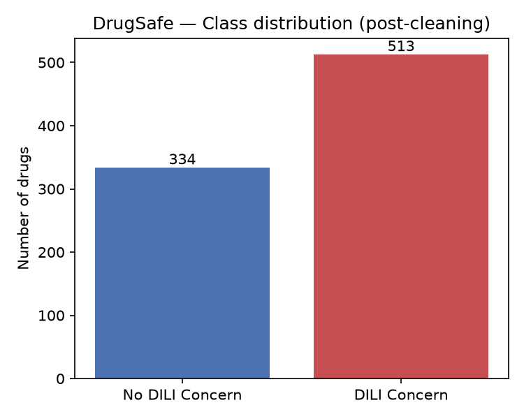
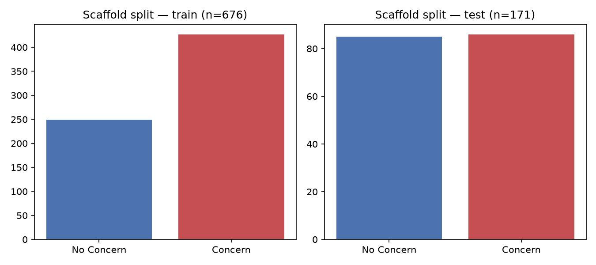
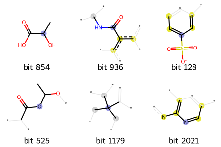
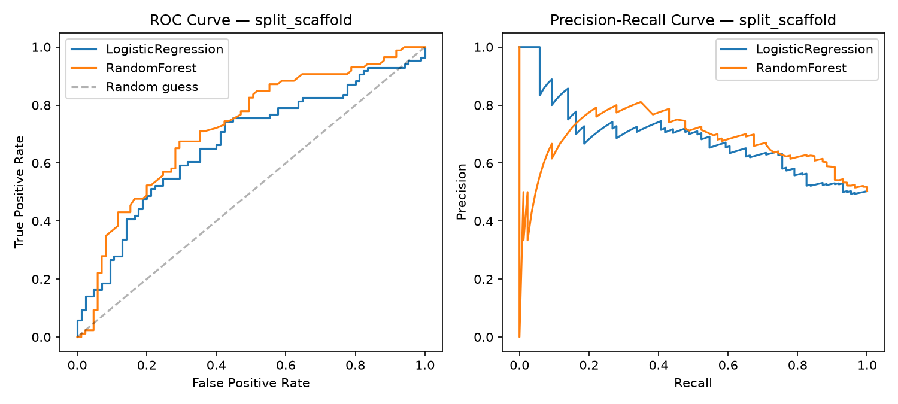

# 🧪 HepatoRisk

### A Cheminformatics Approach to Drug-Induced Liver Injury

Can we use the chemical structure of a drug to predict whether it may be associated with liver injury?

**HepatoRisk** is a cheminformatics project that explores this question using drug structure, molecular fingerprints, and prediction models.

The project uses the FDA **DILIrank 2.0** dataset. Along with prediction, it also looks at which chemical features influence the result using **SHAP** and checks how similar a new molecule is to the compounds used during training.

---

## ⚠️ Important Note
   🔗 **[Try the live app](https://hepatorisk-sigf3grr9l2eiycorwzjad.streamlit.app/)**
This is a **learning and research project**, not a medical or clinical tool.

It cannot tell whether a drug is safe to take and should not be used for making medication-related decisions. The results are based on an existing dataset and the approach has several limitations.

---

## What does it do?

You can enter a drug name, such as `Aspirin`, or enter its **SMILES** string.

HepatoRisk then:

1. Checks whether the molecule is valid.
2. Calculates basic molecular properties.
3. Generates molecular fingerprints.
4. Predicts whether the drug is associated with liver injury risk.
5. Uses **SHAP** to show which features influenced the prediction.
6. Checks whether the molecule is within the model's **applicability domain**.
7. Shows the result through a simple **Streamlit** web app.

---

## Dataset

The project uses the FDA's **DILIrank 2.0** dataset.

The original dataset contains **1,336 approved drugs**, with labels based on their association with drug-induced liver injury.

After cleaning the data, removing duplicates, and excluding entries without usable chemical structures, around **850 drugs** were available for analysis.

The dataset is relatively small, so this is an important limitation when interpreting the results.
   

---

## Workflow

The project follows these main steps:

### 1. Data Preparation

The DILIrank dataset is cleaned and prepared for analysis.

This includes removing entries with missing or unusable chemical structures and handling duplicate records.

---

### 2. Molecular Representation

The chemical structures are converted into numerical features that can be used by the prediction models.

**RDKit** is used for handling the molecular structures and generating the required molecular features and fingerprints.

---

### 3. Train-Test Split

The compounds are divided into training and testing sets.

The training set is used to build the models, while the test set is kept separate to evaluate how the models perform on unseen compounds.

The project also uses a **scaffold-based split** to reduce the chance of very similar chemical structures appearing in both training and testing data.
   

---

### 4. Prediction Models

Two approaches are compared:

* **Baseline model**
* **Random Forest**

The models are evaluated using multiple metrics rather than relying only on accuracy.

This gives a better idea of how the models are performing, especially when the classes are not perfectly balanced.

---

### 5. Model Explainability

**SHAP (SHapley Additive exPlanations)** is used to understand the predictions.

Instead of only getting a final prediction, SHAP helps identify which molecular features contributed to that prediction.

This makes it easier to understand what the model is picking up from the chemical structure.    

---

### 6. Applicability Domain

A prediction is not equally reliable for every molecule.

The project therefore includes an **applicability check** to see how similar an input molecule is to the compounds used during training.

If a molecule is very different from the training compounds, the prediction is treated with more caution.

---

### 7. Streamlit Application

The final workflow is connected to a **Streamlit** application.

The user can enter a drug name or SMILES and view the molecular information, prediction, confidence-related information, and explanation.

---

## Results

The **Random Forest** model performed better than the simpler baseline model.

This suggests that the molecular features used in the project contain useful information related to the liver injury labels in the dataset.

However, performance decreased when the model was tested on compounds with **unfamiliar chemical scaffolds**.

This is important because a model can perform well on molecules that are similar to the compounds it has already seen, but may struggle with structurally different compounds.
   

The applicability check is included to make this limitation clearer instead of treating every prediction as equally reliable.

---

## How to Run the Project

### Requirements

You will need:

* Python
* DILIrank 2.0 dataset
* The packages listed in `requirements.txt`

### 1. Install the required packages

```powershell
pip install -r requirements.txt
```

### 2. Add the DILIrank dataset

Place the downloaded file here:

```text
data/raw/dilirank2.xlsx
```

### 3. Run the workflow

Run the scripts in this order:

```powershell
python src/data_prep.py
python src/featurize_and_split.py
python src/train_and_evaluate.py
python src/explain_and_applicability.py
python src/train_final_model.py
```

### 4. Start the Streamlit app

```powershell
python -m streamlit run app/app.py
```

Each script prints information while running, so you can follow the different stages of the workflow.

---

## Project Structure

```text
hepatorisk/
├── data/            → raw and processed drug data
├── src/             → data preparation, feature generation and prediction scripts
├── app/             → Streamlit web application
├── models/          → trained models
├── figures/         → generated charts and figures
└── requirements.txt → required Python packages
```

The dataset and trained models are not included in the repository. They can be generated by running the workflow above.

---

## Limitations

There are some important limitations to keep in mind:

* **The dataset is relatively small.** Around 850 drugs were available after preprocessing.
* **The DILIrank labels are based on existing evidence.** They come from expert assessment of drug labels and case reports rather than a direct laboratory measurement.
* **Chemical similarity matters.** The model may perform better on compounds that are similar to those in the training data.
* **Different scaffolds can be challenging.** Performance decreases when the model encounters unfamiliar chemical structures.
* **Only chemical structure is considered.** Factors such as dosage, metabolism, patient characteristics, and other biological factors are not included.
* **The model has not been clinically validated.** The evaluation is based on existing data and does not establish how it would perform in real-world clinical use.

---

## Technologies Used

* **Python**
* **RDKit** – molecular structure handling and cheminformatics
* **pandas** – data processing
* **scikit-learn** – prediction models
* **SHAP** – model explainability
* **matplotlib** – visualization
* **Streamlit** – web application

---

## Project Goal

The main goal of HepatoRisk is to explore how **chemical structure and cheminformatics** can be used to study drug-induced liver injury.

The project focuses on three things:

* identifying patterns in drug structures,
* making predictions based on those patterns, and
* understanding when those predictions may or may not be reliable.
